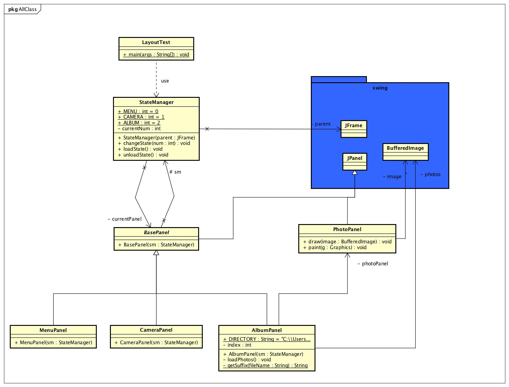

# About
Raspberry pi を利用したカメラソフトウェアです。

# PACKAGES

## layoutTest package
基本となるクラス群が含まれています。 

- LayoutTest:		mainクラスが含まれています。最初に見るべきはこのクラスです。 
- StateManager:	表示するパネルの管理を行うクラスです。 

## panels package
表示するパネルのクラス群が含まれています。 

- BasePanel:		今回raspberry piの画面いっぱいに表示するパネルは、このクラスを継承したクラスになっています。 
- MenuPanel:		メニュー画面を表すクラスです。 
- CameraPanel:	カメラ画面を表すクラスです。 
- AlbumPanel:		アルバム画面を表すクラスです。 
- PhotoPanel:		AlbumPanelにおいて、写真表示を担当するクラスです。 